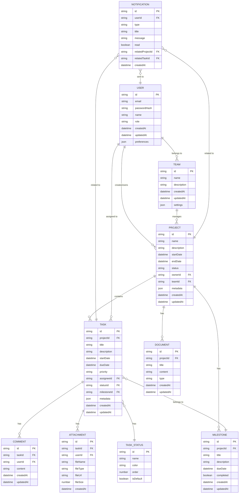

# データモデル

## エンティティ関連図（ERD）

## データモデルの補足説明

### User（ユーザー）
- アプリケーションを利用するユーザーの情報
- ロールには管理者、プロジェクトマネージャー、メンバーなどが存在
- preferencesはユーザーの設定情報を格納するJSON形式のデータ

### Team（チーム）
- プロジェクトを管理するチームの情報
- ユーザーは複数のチームに所属可能
- settingsはチーム設定を格納するJSON形式のデータ

### Project（プロジェクト）
- プロジェクト情報の基本データ
- metadataには自然言語処理から抽出された追加情報を格納
- チームに紐づけられ、複数のタスクやマイルストーンを持つ

### Task（タスク）
- プロジェクト内の個別タスク
- 担当者、ステータス、優先度などの属性を持つ
- マイルストーンに紐づけることが可能
- metadataにはタスク固有の追加情報を格納

### Task_Status（タスクステータス）
- タスクのステータスを定義するマスターデータ
- 「未着手」「進行中」「レビュー中」「完了」などの状態を管理
- カスタムステータスの追加も可能

### Milestone（マイルストーン）
- プロジェクト内の重要な節目や期限を管理
- 複数のタスクをまとめる目標として利用

### Comment（コメント）
- タスクに対するコメント情報
- ユーザー間のコミュニケーションを記録

### Attachment（添付ファイル）
- タスクに添付されたファイル情報
- ファイル実体は外部ストレージに保存し、URLを参照

### Document（ドキュメント）
- プロジェクトに関連する文書情報
- 仕様書、議事録、メモなどを管理

### Notification（通知）
- ユーザーへの通知情報
- タスク期限、ステータス変更、メンション等の通知を管理