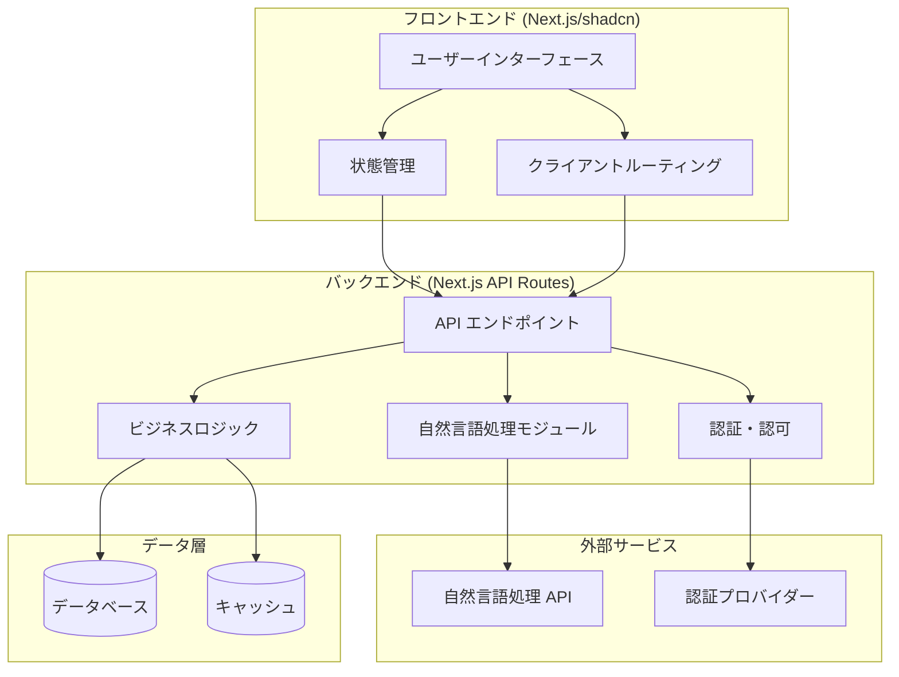
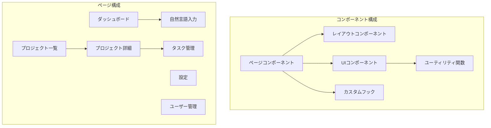
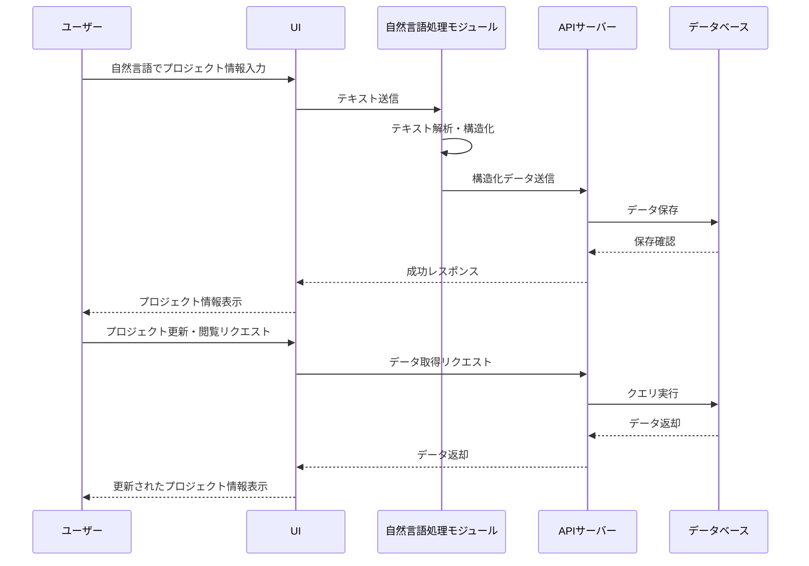
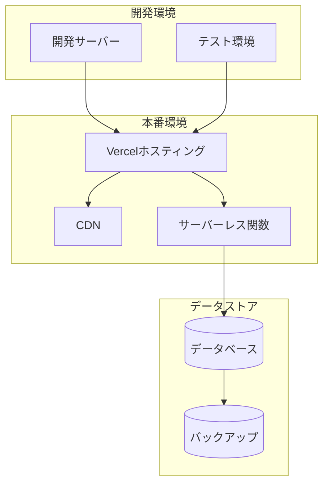

# システムアーキテクチャ

## システム概要図

```mermaid
graph TD
  subgraph "フロントエンド (Next.js/shadcn)"
    UI[ユーザーインターフェース]
    StateManagement[状態管理]
    ClientRouting[クライアントルーティング]
  end

  subgraph "バックエンド (Next.js API Routes)"
    API[API エンドポイント]
    Auth[認証・認可]
    NLP[自然言語処理モジュール]
    BusinessLogic[ビジネスロジック]
  end

  subgraph "外部サービス"
    NLP_API[自然言語処理 API]
    AuthProvider[認証プロバイダー]
  end

  subgraph "データ層"
    DB[(データベース)]
    Cache[(キャッシュ)]
  end

  UI --> StateManagement
  UI --> ClientRouting
  StateManagement --> API
  ClientRouting --> API
  API --> Auth
  API --> NLP
  API --> BusinessLogic
  Auth --> AuthProvider
  NLP --> NLP_API
  BusinessLogic --> DB
  BusinessLogic --> Cache
```

## コンポーネント詳細

### フロントエンドコンポーネント

```mermaid
graph TD
  subgraph "コンポーネント構成"
    Pages[ページコンポーネント]
    Layout[レイアウトコンポーネント]
    UIComponents[UIコンポーネント]
    Hooks[カスタムフック]
    Utils[ユーティリティ関数]
  end

  subgraph "ページ構成"
    Dashboard[ダッシュボード]
    ProjectList[プロジェクト一覧]
    ProjectDetail[プロジェクト詳細]
    TaskManager[タスク管理]
    NLPInput[自然言語入力]
    Settings[設定]
    UserManagement[ユーザー管理]
  end

  Pages --> Layout
  Pages --> UIComponents
  Pages --> Hooks
  UIComponents --> Utils

  Dashboard --> NLPInput
  ProjectList --> ProjectDetail
  ProjectDetail --> TaskManager
```

### データフロー図

```mermaid
sequenceDiagram
  participant User as ユーザー
  participant UI as UI
  participant NLP as 自然言語処理モジュール
  participant API as APIサーバー
  participant DB as データベース
  
  User->>UI: 自然言語でプロジェクト情報入力
  UI->>NLP: テキスト送信
  NLP->>NLP: テキスト解析・構造化
  NLP->>API: 構造化データ送信
  API->>DB: データ保存
  DB-->>API: 保存確認
  API-->>UI: 成功レスポンス
  UI-->>User: プロジェクト情報表示
  
  User->>UI: プロジェクト更新・閲覧リクエスト
  UI->>API: データ取得リクエスト
  API->>DB: クエリ実行
  DB-->>API: データ返却
  API-->>UI: データ返却
  UI-->>User: 更新されたプロジェクト情報表示
```

### デプロイ構成図

```mermaid
graph TD
  subgraph "開発環境"
    Dev[開発サーバー]
    Tests[テスト環境]
  end

  subgraph "本番環境"
    CDN[CDN]
    Vercel[Vercelホスティング]
    ServerlessAPI[サーバーレス関数]
  end

  subgraph "データストア"
    DB[(データベース)]
    Backup[(バックアップ)]
  end

  Dev --> Vercel
  Tests --> Vercel
  Vercel --> CDN
  Vercel --> ServerlessAPI
  ServerlessAPI --> DB
  DB --> Backup
```