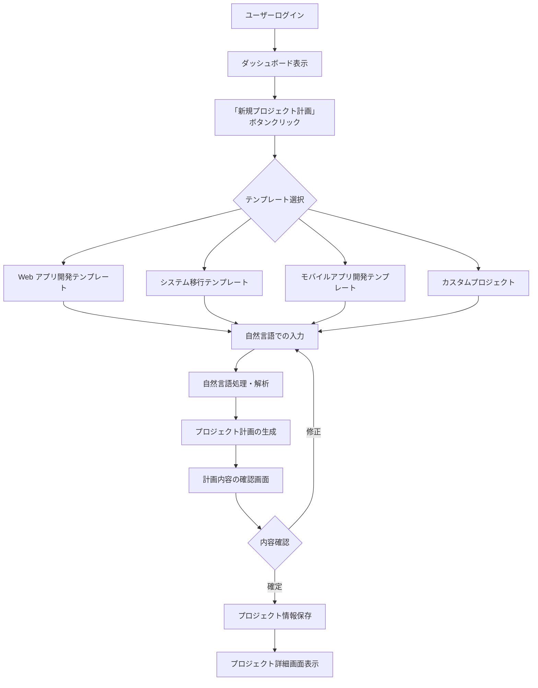
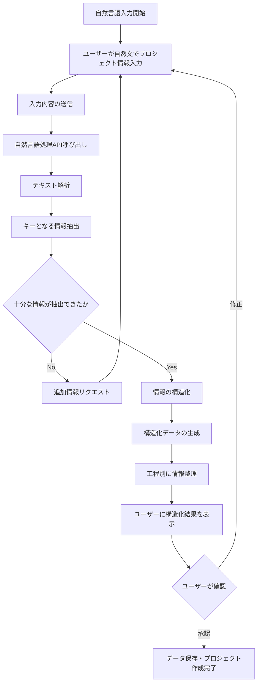
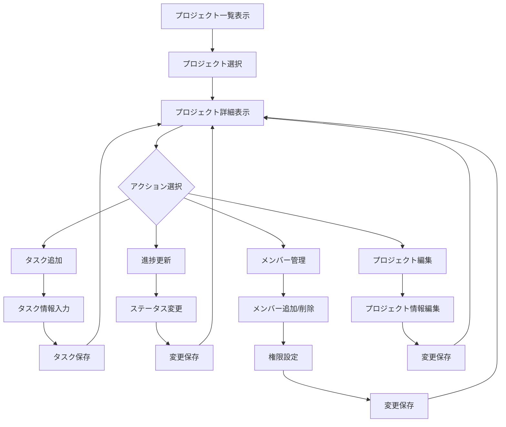
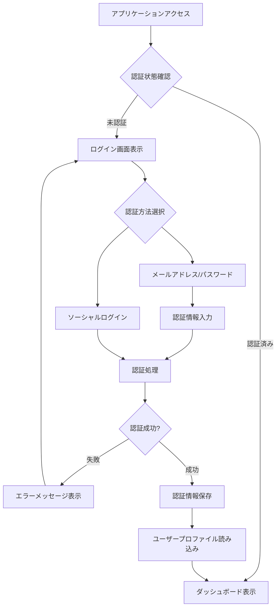
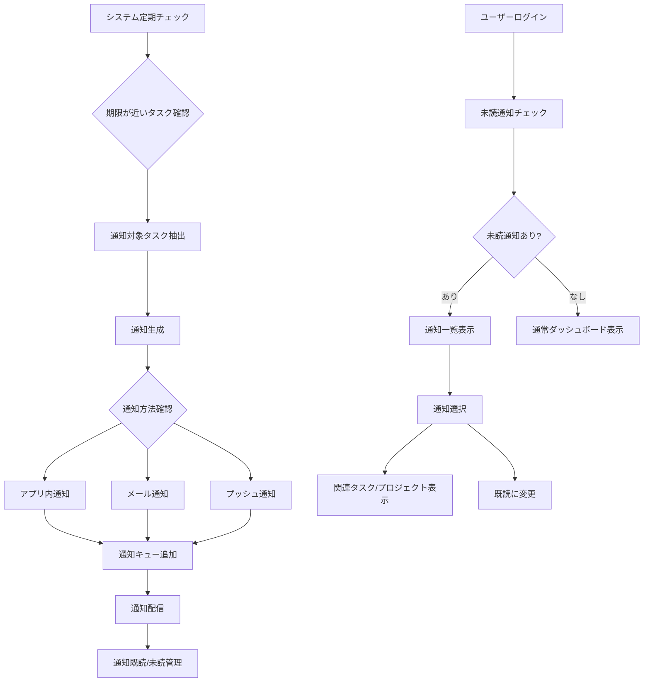

# ユーザーフロー

## 新規プロジェクト計画フロー

```mermaid
flowchart TD
    A[ユーザーログイン] --> B[ダッシュボード表示]
    B --> C[「新規プロジェクト計画」ボタンクリック]
    C --> D{テンプレート選択}
    D --> E[Web アプリ開発テンプレート]
    D --> F[システム移行テンプレート]
    D --> G[モバイルアプリ開発テンプレート]
    D --> H[カスタムプロジェクト]
    E --> I[自然言語での入力]
    F --> I
    G --> I
    H --> I
    I --> J[自然言語処理・解析]
    J --> K[プロジェクト計画の生成]
    K --> L[計画内容の確認画面]
    L --> M{内容確認}
    M -- 修正 --> I
    M -- 確定 --> N[プロジェクト情報保存]
    N --> O[プロジェクト詳細画面表示]
```

## 自然言語処理フロー

```mermaid
flowchart TD
    A[自然言語入力開始] --> B[ユーザーが自然文でプロジェクト情報入力]
    B --> C[入力内容の送信]
    C --> D[自然言語処理API呼び出し]
    D --> E[テキスト解析]
    E --> F[キーとなる情報抽出]
    F --> G{十分な情報が抽出できたか}
    G -- No --> H[追加情報リクエスト]
    H --> B
    G -- Yes --> I[情報の構造化]
    I --> J[構造化データの生成]
    J --> K[工程別に情報整理]
    K --> L[ユーザーに構造化結果を表示]
    L --> M{ユーザーが確認}
    M -- 修正 --> B
    M -- 承認 --> N[データ保存・プロジェクト作成完了]
```

## プロジェクト管理フロー

```mermaid
flowchart TD
    A[プロジェクト一覧表示] --> B[プロジェクト選択]
    B --> C[プロジェクト詳細表示]
    C --> D{アクション選択}
    D --> E[タスク追加]
    D --> F[進捗更新]
    D --> G[メンバー管理]
    D --> H[プロジェクト編集]
    E --> I[タスク情報入力]
    I --> J[タスク保存]
    J --> C
    F --> K[ステータス変更]
    K --> L[変更保存]
    L --> C
    G --> M[メンバー追加/削除]
    M --> N[権限設定]
    N --> O[変更保存]
    O --> C
    H --> P[プロジェクト情報編集]
    P --> Q[変更保存]
    Q --> C
```

## ユーザー認証フロー

```mermaid
flowchart TD
    A[アプリケーションアクセス] --> B{認証状態確認}
    B -- 未認証 --> C[ログイン画面表示]
    B -- 認証済み --> D[ダッシュボード表示]
    C --> E{認証方法選択}
    E --> F[メールアドレス/パスワード]
    E --> G[ソーシャルログイン]
    F --> H[認証情報入力]
    H --> I[認証処理]
    G --> I
    I --> J{認証成功?}
    J -- 失敗 --> K[エラーメッセージ表示]
    K --> C
    J -- 成功 --> L[認証情報保存]
    L --> M[ユーザープロファイル読み込み]
    M --> D
```

## 通知・アラートフロー

```mermaid
flowchart TD
    A[システム定期チェック] --> B{期限が近いタスク確認}
    B --> C[通知対象タスク抽出]
    C --> D[通知生成]
    D --> E{通知方法確認}
    E --> F[アプリ内通知]
    E --> G[メール通知]
    E --> H[プッシュ通知]
    F --> I[通知キュー追加]
    G --> I
    H --> I
    I --> J[通知配信]
    J --> K[通知既読/未読管理]
    
    L[ユーザーログイン] --> M[未読通知チェック]
    M --> N{未読通知あり?}
    N -- あり --> O[通知一覧表示]
    N -- なし --> P[通常ダッシュボード表示]
    O --> Q[通知選択]
    Q --> R[関連タスク/プロジェクト表示]
    Q --> S[既読に変更]
```